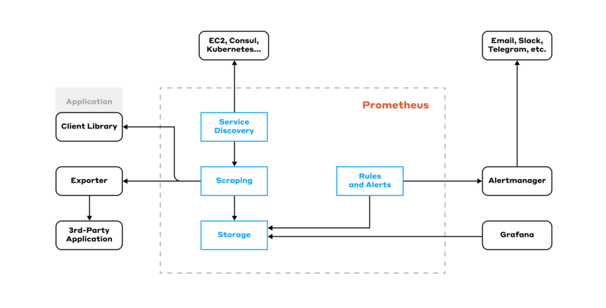

# Houd grip op je applicatie: monitoren met Prometheus


*[Mitchel Fleury, oktober 2024.](https://github.com/hanaim-devops/blog-MitchelFleury)*
<hr/>

Een draaiende applicatie kan tegen problemen aanlopen. Maar hoe kom je er achter dat er een probleem is en wat dat probleem dan is? Een tool als Prometheus verzameld metrics en geeft automatisch meldingen wanneer er iets fout gaat. Wat Prometheus nou precies is en hoe deze tool werkt vertel ik in deze blogpost.

## Wat is Prometheus?
Prometheus is een open-source systems monitoring en alerting toolkit die origineel ontwikkeld is door SoundCloud. Inmiddels is Prometheus een opzichzelf staand project dat sinds 2016 op CNCF staat (Prometheus, z.d.-a). 

### Features
Prometheus slaat de data op als 'time series data', dus de data met daarbij ook de timestamp. 'Time series' is een reeks aan data die op basis van tijd wordt gesorteerd (Wikipedia, z.d.). Dit kan het makkelijker maken om grafieken op basis van tijd te maken.

PromQL (Prometheus Query Langue) is een eigen query taal van Prometheus om data te kunnen ophalen (Prometheus, z.d.-b). De resultaten van een query worden weergegeven in een grafiek, een gegevenstabel of kunnen worden opgehaald via een HTTP API.

Elke prometheus server heeft zijn eigen data en is zelfstandig. Dit brengt zijn voordelen mee zoals betrouwbaarheid (als een andere node weg valt blijft deze draaien) en schaalbaarheid door replicatie. Maar dit brengt ook een nadeel met zich mee, omdat het geen gedistributeerde opslag ondersteunt (Ritesh, 2024). Hier zou je een andere tool voor moeten gebruiken.

Prometheus gebruikt een pull model dat data ophaalt via HTTP. Een pull model maakt het onder andere mogelijk om een centrale plek te hebben voor configuratie (Daniel F, 2024). 

### Belangrijkste termen

- Prometheus server: Dit is de kern van het systeem. Het haalt metrics op, slaat ze op en biedt de mogelijkheid om queries uit te voeren via PromQL (Tigera, z.d.).
- Exporter: Is een kleine applicatie die runt naast de applicatie waar je data van wilt ophalen. De exporter maakt de data beschikbaar, vaak moet de data nog wel worden omgezet naar een formaat dat Prometheus ondersteunt (Prometheus, z.d.-c).
- Alertmanager: Verwerkt alerts en verstuurd dan meldingen naar een platform naar keuze (bijv slack).

Prometheus (z.d.-c) heeft een eigen waar je nog meer termen kan vinden.

## Architectuur


*Afbeelding 2: Prometheus architectuur*

Nu we weten wat Prometheus is en doet is het ook belangrijk om te weten hoe het werkt. In afbeelding 2 is de architectuur te zien in een ontwerp.

De *Service Discovery* inventariseert naar systemen waar 'metrics' kunnen worden opgehaald. Deze metrics worden gescraped met HTTP via het Pull model, door bijvoorbeeld aan een API te vragen om metrics. Dit scrapen doen de *exporters.* Deze exporters weten hoe ze de metrics kunnen ophalen, van bijvoorbeeld een API of database, en zetten de data om in een formaat dat kan worden gelezen door Prometheus.

Naast het ophalen van data wil je er ook iets mee doen. Prometheus staat niet bekend om het visualizeren van de data. Hier kan je een tool zoals Grafana voor gebruiken.

Ook kan je *rules* en *alerts* instellen in Prometheus. Je kan rules instellen die een alert triggeren. Een voorbeeld hiervan is een rule die een alert triggert wanneer een service down is voor 1 minuut. Deze alert komt binnen in de *alertmanager*. De alertmanager kan acties uitvoeren op basis van deze alerts. Een voorbeeld hiervan is dat de alertmanager een melding kan sturen naar Slack. 

## Prometheus in gebruik

Voor mijn onderzoek heb ik een simpele 'hello world' applicatie gemaakt met Promteheus.

Je begint met een `prometheus.yml` waar je vertelt wat prometheus moet doen. In dit geval definieer je dat Prometheus om de 10 seconde data ophaalt en definieer je de targets waar je de data van ophaalt. Om er voor te zorgen dat anderen dit kunnen 'naspelen' haal ik alleen de data op van prometheus en de node exporter zelf. Als uitbreiding kan je hier als target bijvoorbeeld een eigen API aan koppelen. 
```
global:
  scrape_interval: 10s
  evaluation_interval: 10s
scrape_configs:
 - job_name: ulises-prometheus
   static_configs:
    - targets:
       - prometheus:9090
 - job_name: node
   static_configs:
    - targets:
       - node-exporter:9100
```

Ik gebruik Prometheus in Docker, zodat ik het niet lokaal hoef te installeren. Ik maak hier dus een `docker-compose.yml` file voor aan.
```
version: '3'
services:
  prometheus:
    image: prom/prometheus
    volumes:
      - "./prometheus.yml:/etc/prometheus/prometheus.yml"
      - "./rules.yml:/etc/prometheus/rules.yml"
    networks:
      - localprom
    ports:
      - 9090:9090
  node-exporter:
    image: prom/node-exporter
    networks:
      - localprom
    ports:
      - 9100:9100
networks:
  localprom:
    driver: bridge
```

Dit zorgt er voor dat je in de browser (localhost:9090) in Prometheus kan kijken naar de data die wordt opgehaald.

Om alerts toe te voegen, is nog een extra configuratie nodig. Hier maak je een `rules.yml` bestand voor aan. Dit bestand zorgt er voor dat er een alert plaats vindt wanneer een service 'down' is.
```
groups:
 - name: instanceDownRule
   rules:
   - alert: InstanceDown
     expr: up == 0
     for: 5s
```

De rule en de alertmanager moeten worden toegevoegd aan de `prometheus.yml`.
```
rule_files:
  - rules.yml
alerting:
  alertmanagers:
   - static_configs:
     - targets:
        - alert-manager:9093
```

Ook in de `docker-compose.yml` moet de alertmanager gedifineerd worden als een service.
```
alert-manager:
  image: prom/alertmanager
  networks:
    - localprom
  ports:
    - 9093:9093
```

Bij het opnieuw uitvoeren van docker-compose up zal de alertmanager draaien op poort 9093. Om de alert te testen kan je handmatig in docker de node-exporter uitzetten. Dit resulteert in een alert die binnenkomt in de alertmanager.

## Voor- en nadelen

Ik vind zelf de documentatie van Prometheus beginner vriendelijk. Er wordt naar mijn mening goed beschreven wat een bepaald onderwerp is en hoe het werkt. Er wordt ook doorgelinkt naar andere pagina's in de documentatie voor meer informatie. Daarnaast is er ook een glossary die de belangrijkste termen kort beschrijft, dit vond ik als 'beginner' erg fijn.

Prometheus is erg gericht op time series data. Het heeft een eigen database (TSDB) die is geoptimaliseerd voor deze data (Vickers B, 2020). Het nadeel hiervan is wel dat het minder geschikt is voor event- of log-monitoring.

Er is een alerting systeem waar je meldingen van kan krijgen wanneer er iets fout gaat in je systeem. 

Een groot nadeel aan Prometheus is dat het uitzichzelf niet geschikt is voor long-term monitoring (Ritesh, 2024). Prometheus kan op kleinere projecten goed meeschalen, maar heeft wel moeite voor grotere projecten. Prometheus slaat veel data op, al helemaal als je het opschaalt. Dit kan tot hoge kosten leiden en dat is iets wat je liever niet wilt. Om deze problemen te verhelpen zou je een tool als Thanos kunnen gebruiken. Ik raad je aan om de blog over Thanos te lezen van mijn collega Jelmer (BRON).

Prometheus is open source en dit brengt twee voordelen met zich mee. Prometheus is gratis en wordt ondersteund door een grote community. Zo zijn er meer dan 900 contributors op GitHub.

## Conclusie

Prometheus is een monitoring tool voor het ophalen en opslaan van time series data. Deze data geeft real-time inzicht inzicht in de huidige status de systemen. Daarnaast ondersteunt Prometheus alerts via de alertmanager naar platformen zoals Slack, zodat je gelijk op de hoogte bent van problemen. Voordat je Prometheus gebruikt moet je nadenken of dit de juiste tool is voor jouw usecase, zo is het bijvoorbeeld niet geschikt om events op te slaan. 

## Bronnen

- Daniel F. (2024, 12 juli). *Is Prometheus Monitoring Push or Pull?*. SigNoz. Geraadpleegd op 7 oktober 2024, via https://signoz.io/guides/is-prometheus-monitoring-push-or-pull/
- Prometheus. (z.d.-a). *Prometheus overview*. Prometheus. Geraadpleegd op 7 oktober 2024, via https://prometheus.io/docs/introduction/overview/
- Prometheus. (z.d.-b). *Querying Prometheus*. Prometheus. Geraadpleegd op 7 oktober 2024, via https://prometheus.io/docs/prometheus/latest/querying/basics/
- Prometheus. (z.d.-c). *Glossary*. Prometheus. Geraadpleegd op 7 oktober 2024, via https://prometheus.io/docs/introduction/glossary/
- Ritesh. (2024, 22 juli). *Scaling Prometheus with Thanos*. Clouddraft. Geraadpleegd op 8 oktober 2024, via https://www.cloudraft.io/blog/scaling-prometheus-with-thanos
- Tigera. (z.d.). *Prometheus Monitoring: Use Cases, Metrics, and Best Practices*. Tigera. Geraadpleegd op 7 oktober 2024, via https://www.tigera.io/learn/guides/prometheus-monitoring/
- Vickers B. (2020, 8 maart). *How Not to Use Prometheus: Storing Events*. Ben Vickers. Geraadpleegd op 9 oktober 2024, via https://bjv.me/2020/03/08/An-Anti-Tutorial-Storing-Events-In-Prometheus
- Wikipedia. (z.d.). *Time series*. Wikipedia. Geraadpleegd op 7 oktober 2024, via https://en.wikipedia.org/wiki/Time_series


[Prometheus logo](https://commons.wikimedia.org/wiki/File:Prometheus_software_logo.svg)
[Prometheus Architectuur](https://blog.palark.com/prometheus-architecture-tsdb/)

