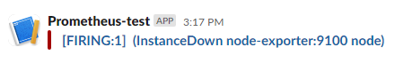

# Houd grip op je applicatie: monitoren met Prometheus


*[Mitchel Fleury, oktober 2024.](https://github.com/hanaim-devops/blog-MitchelFleury)*
<hr/>

Een draaiende applicatie kan tegen problemen aanlopen, maar hoe kom je erachter dat er een probleem is? Een tool als Prometheus verzameld metrics en geeft automatisch meldingen wanneer er iets fout gaat. Wat Prometheus nou precies is en hoe deze tool werkt vertel ik in deze blogpost.

## Wat is Prometheus?

Prometheus is een open-source systems monitoring en alerting toolkit die oorspronkelijk ontwikkeld is door SoundCloud. Inmiddels is Prometheus een opzichzelf staand project dat sinds 2016 op CNCF staat (Prometheus, z.d.-a). Prometheus verzamelt data van systemen door middel van een pull model (hier ga ik later dieper op in) waardoor je de prestaties in real-time kan analyseren. Prometheus slaat de data op als 'time series data', dus de data met daarbij ook de timestamp. 'Time series' is een reeks aan data die op basis van tijd wordt gesorteerd (Tableau, z.d.). Dit kan het makkelijker maken om grafieken op basis van tijd te maken. Dit formaat is geschikt voor het bijhouden van trends en veranderingen in tijd, denk hierbij bijvoorbeeld aan CPU-gebruik.

Om data van Prometheus te kunnen inzien gebruik je PromQL (Prometheus Query Language). Dit is een eigen query taal van Prometheus om data te kunnen ophalen (Prometheus, z.d.-b). De resultaten van een query worden weergegeven in een grafiek, een gegevenstabel of kunnen worden opgehaald via een HTTP API. Voor het maken van een dashboard is Prometheus zelf niet geschikt en raad ik aan om een tool als Grafana te gebruiken.

Prometheus analyseert ook zelf de data en kan alerts versturen naar platforms, zoals Slack, doormiddel van de alertmanager (Prometheus, z.d.-c). De alerts worden getriggerd door 'rules', die je zelf definieert. Een voorbeeld van een rule is dat een systeem niet langer dan een minuut uit mag staan. Als dit wel het geval is, levert het een alert op dat uiteindelijk resulteert in bijvoorbeeld een melding op Slack of een email.

## Architectuur


*Afbeelding 2: Prometheus architectuur (Guryanov V, 2023).*

Nu we weten wat Prometheus is en doet is het ook belangrijk om te weten hoe het werkt. In afbeelding 2 is een schets te zien van de architectuur van Prometheus

De *Service Discovery* inventariseert en identificeert systemen waarvan metrics kunnen worden verzameld. Deze metrics worden gescraped met HTTP via het Pull model, door bijvoorbeeld aan een API te vragen om metrics. Dit scrapen doen de *exporters.* Deze exporters weten hoe ze de metrics kunnen ophalen, van bijvoorbeeld een API of database en zetten de data om in een formaat dat kan worden gelezen door Prometheus.

Naast het ophalen van data wil je er ook iets mee doen. Je kan de data visualiseren of een 'rule' opstellen. Prometheus staat niet bekend om het visualiseren van de data. Hier kan je een tool zoals Grafana voor gebruiken. Zoals ik al zei kan je ook rules instellen die een alert triggeren. Een voorbeeld hiervan is een rule die een alert triggert, wanneer een service down is voor 1 minuut. Deze alert komt binnen in de *alertmanager*. De alertmanager kan acties uitvoeren op basis van deze alerts. Enkele voorbeelden hiervan zijn dat de alertmanager een melding kan sturen naar Slack of een email kan versturen.

## Prometheus in gebruik

Voor mijn onderzoek heb ik een simpele 'hello world' applicatie gemaakt met Promteheus.

Je begint met een `prometheus.yml` waar je vertelt wat prometheus moet doen. In dit geval definieer je dat Prometheus om de 10 seconden data ophaalt en definieer je de targets waar je de data van ophaalt. Om ervoor te zorgen dat anderen dit kunnen 'naspelen' haal ik alleen de data op van prometheus en de node exporter zelf. Als uitbreiding kan je hier als target bijvoorbeeld een eigen API aan koppelen.

```yml
global:
  scrape_interval: 10s
  evaluation_interval: 10s
scrape_configs:
 - job_name: ulises-prometheus
   static_configs:
    - targets:
       - prometheus:9090
 - job_name: node
   static_configs:
    - targets:
       - node-exporter:9100
```

Ik gebruik Prometheus in Docker, zodat ik het niet lokaal hoef te installeren. Ik maak hier dus een `docker-compose.yaml` file voor aan.

```yaml
version: '3'
services:
  prometheus:
    image: prom/prometheus
    volumes:
      - "./prometheus.yml:/etc/prometheus/prometheus.yml"
      - "./rules.yml:/etc/prometheus/rules.yml"
    networks:
      - localprom
    ports:
      - 9090:9090
  node-exporter:
    image: prom/node-exporter
    networks:
      - localprom
    ports:
      - 9100:9100
networks:
  localprom:
    driver: bridge
```

Dit zorgt ervoor dat je in de browser (localhost:9090) in Prometheus kan kijken naar de data die wordt opgehaald.

Om alerts toe te voegen, is nog een extra configuratie nodig. Hier maak je een `rules.yml` bestand voor aan. Dit bestand zorgt ervoor dat er een alert plaats vindt wanneer een service 'down' is.

```yml
groups:
 - name: instanceDownRule
   rules:
   - alert: InstanceDown
     expr: up == 0
     for: 5s
```

De rule en de alertmanager moeten worden toegevoegd aan de `prometheus.yml`.

```yml
rule_files:
  - rules.yml
alerting:
  alertmanagers:
   - static_configs:
     - targets:
        - alert-manager:9093
```

Ook in de `docker-compose.yaml` moet de alertmanager gedefineerd worden als een service.

```yaml
alert-manager:
  image: prom/alertmanager
  networks:
    - localprom
  ports:
    - 9093:9093
```

Bij het opnieuw uitvoeren van docker-compose up zal de alertmanager draaien op poort 9093. Om de alert te testen kan je handmatig in docker de node-exporter uitzetten. Dit resulteert in een alert die binnenkomt in de alertmanager.

Om iets te doen met deze alerts, zoals het sturen van berichten naar Slack, heb je nog een extra configuratie nodig. Maak een `alertmanager.yml` aan. Hier definieer je naar welk slack kanaal een bericht moet worden gestuurd. Je hebt wel een `api_url` van Slack nodig, hier heb ik een eigen Slack app voor gemaakt.

```yml
global:
  resolve_timeout: 5m

route:
  receiver: 'slack-notifications'

receivers:
  - name: 'slack-notifications'
    slack_configs:
      - api_url: 'YOUR SLACK URL'
        channel: '#YOUR-CHANNEL'
        send_resolved: true
```

Pas ook de `docker-compose.yaml` aan zodat er een volume is voor de alertmanager

```yml
  alert-manager:
    image: prom/alertmanager
    volumes:
      - "./alertmanager.yml:/etc/alertmanager/alertmanager.yml"  # Voeg deze regel toe
    networks:
      - localprom
    ports:
      - 9093:9093
```

Als we nu weer de node-exporter uitzetten, resulteert dit in een melding in Slack zoals te zien is in afbeelding 3.



*Afbeelding 3: Slack melding.*

## Voor- en nadelen

Ik vind zelf de documentatie van Prometheus beginner vriendelijk, al is niet iedereen in de community het daar mee eens. Er wordt naar mijn mening goed beschreven wat een bepaald onderwerp is en hoe het werkt. Er wordt ook doorgelinkt naar andere pagina's in de documentatie voor meer informatie. Daarnaast is er ook een glossary die de belangrijkste termen kort beschrijft, dit vond ik als 'beginner' erg fijn.

Prometheus is erg gericht op time series data. Het heeft een eigen database (TSDB) die is geoptimaliseerd voor deze data (Vickers B, 2020). Het nadeel hiervan is wel dat het minder geschikt is voor event- of log-monitoring.

Er is een alerting systeem waar je meldingen van kan krijgen wanneer er iets fout gaat in je systeem.

Een groot nadeel aan Prometheus is dat het uit zichzelf niet geschikt is voor long-term monitoring (Ritesh, 2024). Prometheus kan op kleinere projecten goed meeschalen, maar heeft wel moeite voor grotere projecten. Prometheus slaat veel data op, al helemaal als je het opschaalt. Dit kan tot hoge kosten leiden en dat is iets wat je liever niet wilt. Om deze problemen te verhelpen zou je een tool als Thanos kunnen gebruiken. Ik raad je aan om de blog over Thanos te lezen van mijn collega Noppert (2024). Prometheus draait standaard als een enkele node, dit kan een single point of failure worden als deze weg valt (Daniel F, 2024). Met extra configuratie kunnen er meerdere nodes draaien. Ook hier helpt Thanos mee.

Prometheus is open source en dit brengt twee voordelen met zich mee. Prometheus is gratis en wordt ondersteund door een grote community. Zo zijn er meer dan 900 contributors op GitHub.

Elke prometheus server heeft zijn eigen data en is zelfstandig. Dit brengt zijn voordelen mee zoals betrouwbaarheid (als een andere node weg valt blijft deze draaien) en schaalbaarheid door replicatie. Echter brengt dit ook een nadeel met zich mee, omdat het geen gedistributeerde opslag ondersteunt (Ritesh, 2024). Hier zou je een andere tool voor moeten gebruiken.

## Conclusie

Prometheus kan effectief worden ingezet voor monitoring en alerting in een DevOps-omgeving. Het systeem verzamelt eenvoudig metrics van verschillende bronnen met behulp van exporters, terwijl de alertmanager meldingen verstuurt wanneer er problemen zijn. Dit maakt het mogelijk om snel inzicht te krijgen in de prestaties van systemen en om tijdig actie te kunnen ondernemen.

Prometheus is geschikt voor kortetermijnanalyses en real-time monitoring, maar minder voor long-term monitoring en log-gebaseerde data. Voor deze toepassingen is het nodig om aanvullende tools zoals Thanos in te zetten. Door de goede integratie met tools zoals Grafana voor visualisatie en onder andere Slack voor meldingen, kan Prometheus goed worden gebruikt in zowel kleine als grote projecten.

## Bronnen

- Daniel F. (2024, 12 juli). *Is Prometheus Monitoring Push or Pull?*. SigNoz. Geraadpleegd op 7 oktober 2024, via https://signoz.io/guides/is-prometheus-monitoring-push-or-pull/
- Guryanov V. (2023, 17 oktober). *Prometheus and its storage: Architecture, challenges, and solutions*. Palark. Geraadpleegd op 9 oktober 2024, via https://blog.palark.com/prometheus-architecture-tsdb/
- Noppert J. (2024 oktober). *De ultieme Endgame voor je metrics: Thanos*. GitHub. Geraadpleegd op 9 oktober 2024, via https://github.com/hanaim-devops/devops-blog-pietknoppert/tree/main/src/dev-blog-thanos-snapt-je-devops-together
- Prometheus. (z.d.-a). *Prometheus overview*. Prometheus. Geraadpleegd op 7 oktober 2024, via https://prometheus.io/docs/introduction/overview/
- Prometheus. (z.d.-b). *Querying Prometheus*. Prometheus. Geraadpleegd op 7 oktober 2024, via https://prometheus.io/docs/prometheus/latest/querying/basics/
- Prometheus. (z.d.-c). *Glossary*. Prometheus. Geraadpleegd op 7 oktober 2024, via https://prometheus.io/docs/introduction/glossary/
- Ritesh. (2024, 22 juli). *Scaling Prometheus with Thanos*. Clouddraft. Geraadpleegd op 8 oktober 2024, via https://www.cloudraft.io/blog/scaling-prometheus-with-thanos
- Tableau. (z.d.). *Time Series Analysis: Definition, Types, Techniques, and When It's Used*. Tableau. Geraadpleegd op 10 oktober 2024, via https://www.tableau.com/analytics/what-is-time-series-analysis
- Tigera. (z.d.). *Prometheus Monitoring: Use Cases, Metrics, and Best Practices*. Tigera. Geraadpleegd op 7 oktober 2024, via https://www.tigera.io/learn/guides/prometheus-monitoring/
- Vickers B. (2020, 8 maart). *How Not to Use Prometheus: Storing Events*. Ben Vickers. Geraadpleegd op 9 oktober 2024, via https://bjv.me/2020/03/08/An-Anti-Tutorial-Storing-Events-In-Prometheus
- Wikipedia Commons. (z.d.). *File:Prometheus software logo.svg*. Wikipedia Commons. Geraadpleegd op 7 oktober 2024, via https://commons.wikimedia.org/wiki/File:Prometheus_software_logo.svg
